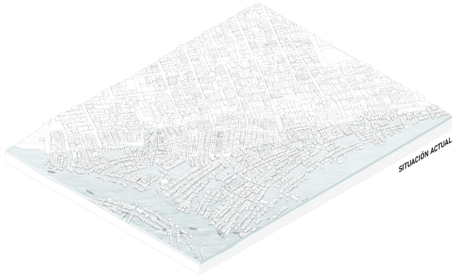
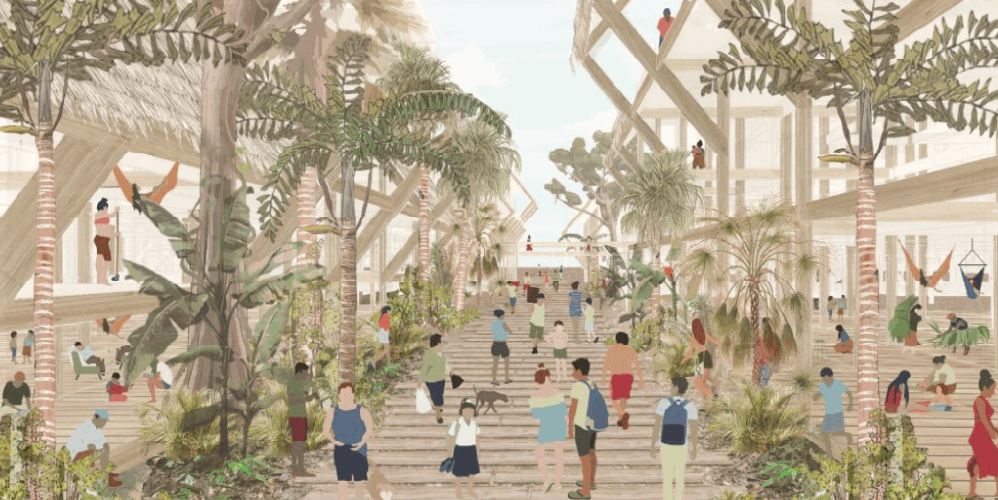

### **Alternative urban model for Bajo Belen, Iquitos**

This research proposes a sustainable and adaptive urban model to address the challenges faced by the flood-prone neighborhood of Bajo Belen, a cultural and economic hub in the Peruvian Amazon. Amid threats of relocation and the loss of territorial identity, the model aims to preserve the essence of Bajo Belen while avoiding current issues such as disconnection, overcrowding, and vulnerability to flooding. The proposal consists of a two-scale intervention: first, a master plan with three key intervention areas—connector, mitigator, and landscape borders—and transversal axes to integrate them; second, an urban and architectural design framework for elements like commerce, roads, housing, communal spaces, docks, and pools, tailored to local techniques, climate, and culture. This intervention demonstrates the potential for a new way of inhabiting the river, preserving social, economic, and environmental connections while ensuring a safe and dignified future for the community.

{fig-align="center"}

{fig-align="center"}



